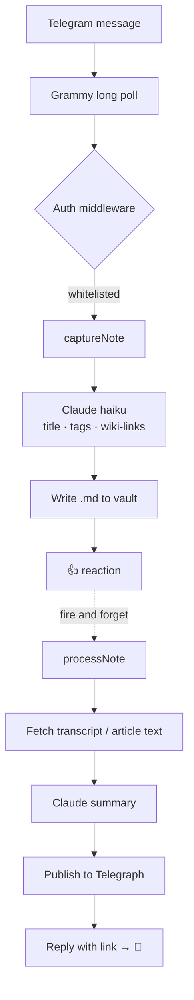

<div align="center">


# Focus Bot

**Send a thought to Telegram. Get an AI-organized note in your Obsidian vault.**

No folders. No categories. No deciding where something goes before you've finished thinking it.

[](https://bun.sh/)
[](https://www.typescriptlang.org/)
[](https://www.npmjs.com/package/@anthropic-ai/claude-agent-sdk)
[](https://grammy.dev/)
[](https://obsidian.md/)
[](#license)


</div>

---

## The idea

Most note systems make you file a thought before you've finished having it. Focus Bot inverts that.

You send a message. Claude reads it, gives it a title, tags it by **what kind of thing it is**, and weaves `[[wiki-links]]` through the body around the concepts worth exploring later. The file lands in your vault. Structure emerges from the graph instead of from a folder tree you have to maintain.

> **Tags classify *what something is*** — `ideas`, `quotes`, `articles`, `books`, `recipes`. Format, not subject.
>
> **Wiki-links classify *what something is about*** — inline, organic, no upfront taxonomy. Frequently linked concepts become hubs on their own.

That's the whole philosophy. Two axes, zero hierarchy.

---

## What it looks like

```
You: "I've been thinking about how trees communicate
      through mycelium networks underground"
Bot: 👍
```

→ creates `Mycelium Communication Networks.md`:

```markdown
---
captured: 2026-02-06T14:34
source: telegram
status: inbox
tags:
  - captures
  - ideas
---
I've been thinking about how [[trees]] communicate through
[[mycelium]] networks underground
```

The filename *is* the title — Obsidian convention, no redundant frontmatter field. `captures` is always applied. Everything else is inferred.

### Send a link instead

```
You: https://www.youtube.com/watch?v=example
Bot: 👍
Bot: https://telegra.ph/Video-Title-02-06   ← readable AI summary
Bot: 💯                                     ← replaces 👍 when enrichment finishes
```

URLs land in `Bookmarks/` with page metadata, an AI summary in an Obsidian callout, and a Telegraph link in the frontmatter. YouTube links get their transcript pulled and summarized. The 👍 arrives immediately — enrichment catches up behind it.

---

## Features

| | |
|---|---|
| ⚡ **Instant capture** | Send a thought, get a note. The write path never waits on enrichment. |
| 🧠 **AI metadata** | Claude generates titles, type-based tags, and inline `[[wiki-links]]` |
| 🎙️ **Voice notes** | Dictate a note — Groq Whisper transcribes, then multi-turn editing lets you refine the draft before it saves |
| 🔗 **URL enrichment** | YouTube transcripts and article text fetched and summarized |
| 📰 **Telegraph publishing** | Summaries published for Telegram's Instant View |
| ✏️ **Editable prompts** | Every AI prompt is a Markdown file *inside your vault*. Edit it; the next message uses it. No restart. |
| 🔍 **Debug logging** | Full prompt/response transcripts for iterating on prompts |
| 🔒 **Access control** | Telegram user ID whitelist |

---

## Architecture



The fast path and the slow path are deliberately separate. Capture is never blocked on a network fetch or a long summarization — you get an acknowledgment in about a second, and enrichment lands later.

Voice takes a parallel route: OGG download → Groq Whisper → Claude draft → in-place editing over multiple turns → 👍 to save.

---

## Quick start

**Prerequisites** — [Bun](https://bun.sh/) · [Claude Code](https://docs.anthropic.com/en/docs/claude-code) CLI on your `PATH` · a bot token from [@BotFather](https://t.me/BotFather) · an Obsidian vault · [yt-dlp](https://github.com/yt-dlp/yt-dlp) for YouTube · a [Groq](https://groq.com/) key for voice

```bash
git clone https://github.com/namick/focus-bot.git
cd focus-bot
bun install
cp .env.example .env   # then edit it
bun run dev            # hot reload
```

### Configuration

| Variable | Required | Purpose |
|---|:---:|---|
| `TELEGRAM_BOT_TOKEN` | ✅ | Bot token from [@BotFather](https://t.me/BotFather) |
| `ALLOWED_USER_IDS` | ✅ | Comma-separated Telegram user IDs — [@userinfobot](https://t.me/userinfobot) tells you yours |
| `NOTES_DIR` | ✅ | Absolute path to your Obsidian vault root |
| `GROQ_API_KEY` | ✅ | Voice transcription (Whisper large-v3-turbo) |
| `ANTHROPIC_API_KEY` | — | Falls back to your Claude subscription if unset |
| `CAPTURE_MODEL` | — | Model for capture (default `haiku`) |
| `ENRICHMENT_MODEL` | — | Model for summaries (default `haiku`) |
| `PROMPTS_DIR` | — | Vault subdirectory for editable prompts, e.g. `Prompts` |
| `TRANSCRIPT_LOG` | — | Debug log path (default `/tmp/focus-bot-transcripts.log`) |
| `CLAUDE_CODE_PATH` | — | Path to the `claude` CLI |

### Vault layout

```
your-vault/
├── Bookmarks/              # auto-created — URL notes land here
│   ├── Article Title.md
│   └── Video Title.md
├── Prompts/                # created when PROMPTS_DIR is set
│   └── Focus Bot/
│       ├── note-capture.md      # text note metadata extraction
│       ├── voice-assistant.md   # voice drafting system prompt
│       ├── video-summary.md     # YouTube summaries
│       └── article-summary.md   # article summaries
├── Note Title.md           # text and voice notes go in the root
└── Another Note.md
```

---

## Usage

### Message types

- **Text** → note in the vault root with AI metadata
- **Voice** → transcribed by Groq Whisper, drafted, refined over as many turns as you want (send more voice or text, react 👍 to save)
- **URL** → `Bookmarks/` note + Telegraph summary
- **YouTube** → transcript fetched, summarized, published

### Commands

| | |
|---|---|
| `/start` | Help message |
| `/health` | Bot health and uptime |
| `/status` | systemd service status |
| `/logs` | Recent log entries |
| `/restart` | Restart the service |

### Editing the prompts

Set `PROMPTS_DIR=Prompts`. On startup the bot seeds its default prompts as Markdown into `Prompts/Focus Bot/` in your vault. Edit any of them and the change takes effect on the next message — no restart. Prompts use `{{variable}}` placeholders (`{{message}}`, `{{transcript}}`, …) substituted at call time.

This turns out to be the feature that matters most in daily use: tuning how the bot thinks is just editing a note.

### Debugging

```bash
tail -f /tmp/focus-bot-transcripts.log
```

Every voice transcription and every LLM exchange — full prompt, full response, timestamped.

---

## Deployment

[**SERVICE_SETUP.md**](SERVICE_SETUP.md) walks through running it as a persistent background service — a **systemd user service** on Linux (no root required) or a **launchd agent** on macOS. The `/status`, `/logs`, and `/restart` Telegram commands are wired to that service, so once it's installed you can manage the bot from your phone.

It's otherwise a plain Bun process, so any supervisor works:

```bash
pm2 start "bun run start" --name focus-bot
```

---

## Note format reference

<details>
<summary><b>Text note</b></summary>

<br>

```markdown
---
captured: 2026-02-06T14:34
source: telegram
status: inbox
tags:
  - captures
  - ideas
---
I've been thinking about how [[trees]] communicate through [[mycelium]] networks underground
```

</details>

<details>
<summary><b>URL note (Bookmarks/)</b></summary>

<br>

```markdown
---
captured: 2026-02-06T14:34
source: telegram
status: inbox
url: "https://example.com/article"
telegraph: "https://telegra.ph/Article-Title-02-06"
tags:
  - captures
  - articles
  - links
---
Check out this article on [[machine learning]] https://example.com/article

> **Article Title**
> A look at recent advances in neural network architectures.
> — example.com

> [!summary] Summary
> This article explores recent advances in machine learning...
> - Key point one
> - Key point two
```

</details>

<details>
<summary><b>Tag vocabulary</b></summary>

<br>

Always plural, always a *type*, never a subject:

`captures` (always applied, enforced in code) · `ideas` · `quotes` · `articles` · `links` · `books` · `recipes` · `poems` · `songs` · `tools` · `movies`

Subject matter is handled entirely by `[[wiki-links]]` in the body.

</details>

---

## Stack

[Bun](https://bun.sh/) (runs TypeScript directly, no build step) · [Grammy](https://grammy.dev/) · [Claude Agent SDK](https://www.npmjs.com/package/@anthropic-ai/claude-agent-sdk) · [Zod](https://zod.dev/) · [telegra.ph](https://www.npmjs.com/package/telegra.ph) · [yt-dlp](https://github.com/yt-dlp/yt-dlp) · [Groq Whisper](https://groq.com/)

The repo follows TDD — `bun test` should be green before anything ships.

## License

MIT
